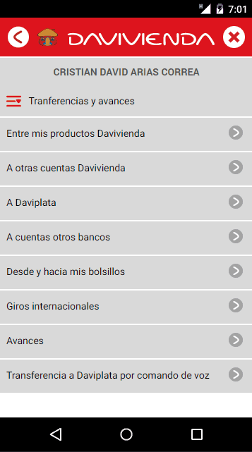

# Vivi
Desarrollo funcionalidad de asistente de comando de voz para Davivienda móvil. 

## Instrucciones
1. Descargar repositorio
2. Ejecutar
```go
	npm install
```
3. Ejecutar 
```go
	ng serve
```
4. Abrir proyecto en localhost

## Demo :clapper:


Using:
* [x] [Angular](https://angular.io/)


Autor:
*  [GitHub](https://github.com/Daniel96114)
	 @Daniel96114

     Daniel Camilo Mesa Salcedo
     daniel961114@gmail.com
     
